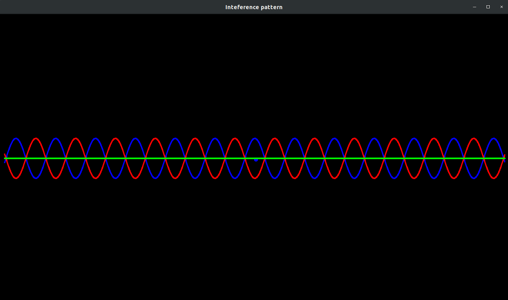

# OneDimensionInterference
Simple C++ program to visualise one dimensional interference.

# Building

Libraries used: SFML.
In project directory run the make command.

# Usage

To run simply run ./interference in the project directory.

# Preview

